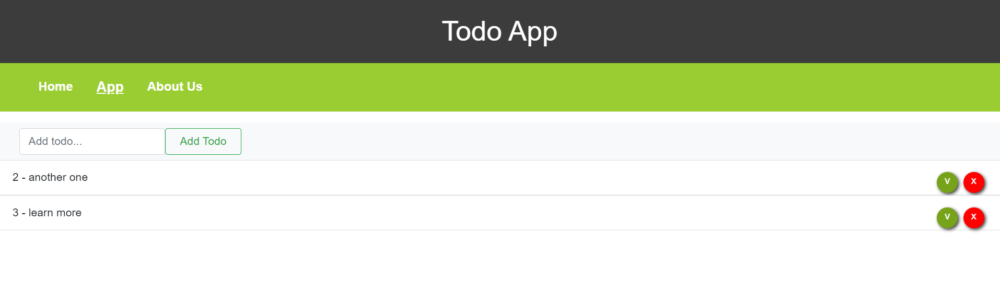

# Todo App Solo

---

### Description
A Todo App made while learning angular after watching and making  few different todo tutorials. Using angular and bootstrap.

---

## Use

To run the angular application you need to run npm install to get the needed packages and ng serve -o to run it in a local server.

---

## Technologies

- Angular
- Type Script
- Bootstrap

---
## Author Info

- Linkedin - [Federico Andrés Jácome Castañeda](https://www.linkedin.com/in/federicojacome/)
- Website - [Portfolio](https://federocky.github.io/PersonalWeb/)

[Back To The Top](#read-me-template)
